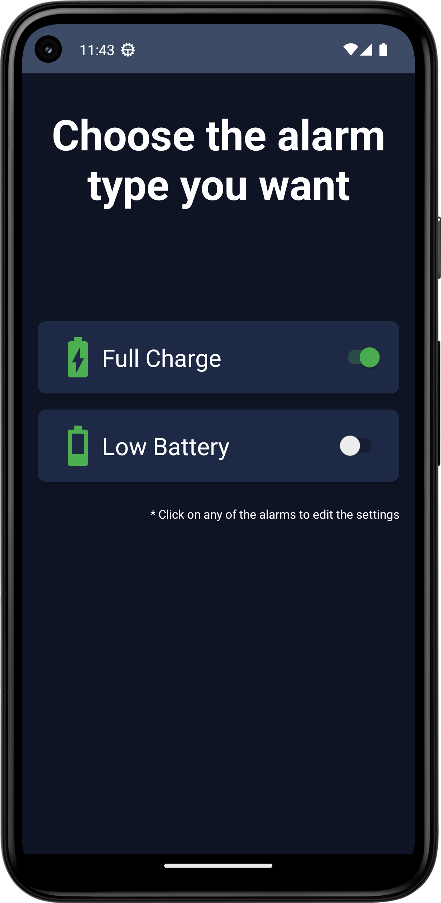

# Battery Alarm

Battery Alarm is a simple and easy-to-use Android app that helps you set custom battery alarms to be notified when your device's battery reaches specific charge levels. Stay informed of a low battery state or when the battery is fully charged.

This app was made with GPT4 in a day.

## Features

- Set alarms for battery low and battery full levels
- Customize alarm thresholds in percentage
- Choose custom notification tones for each alarm
- Enable or disable alarms independently
- Configure alarm repetition and repetition interval

## Screenshots

## How to use
1. Open the app and select the desired alarm type (Battery Low or Battery Full).
2. Use the slider to set the desired battery percentage threshold for the alarm.
3. Check or uncheck the "Alarm Enabled" switch to enable or disable the alarm.
4. Select a custom notification tone for the alarm.
5. Configure alarm repetition and repetition interval if desired.
6. The app will notify you with the selected tone when the battery reaches the configured threshold.

## License

This project is licensed under the Do What The F*ck You Want To Public License - see the [LICENSE](LICENSE) file for details.
